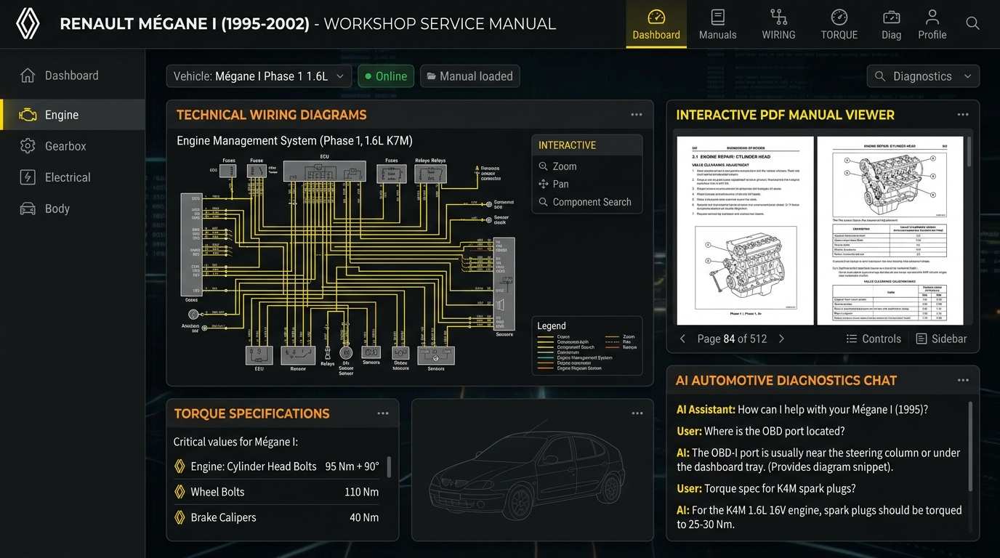

# Renault Mégane I (1995–2002) Workshop Service Manual — AI Assistant 🚗🔧
### المساعد الذكي لكتالوج صيانة وورشة رينو ميجان 1 (الجيل الأول)



A production-ready **Retrieval-Augmented Generation (RAG)** system designed specifically for the complete official **Renault Mégane I (1995–2002) OEM Factory Workshop Service Manual** (`2,492 pages`).

---

## 🌟 الميزات الرئيسية (Key Features)

1. **التعرف التلقائي على اللغة (Bilingual & Language Matching)**:
   * إذا سألت بالعربي، يرد بالعربي مع عزل المصطلحات والفيش والأرقام الإنجليزية بدقة (`BiDi Isolation`).
   * إذا سألت بالإنجليزي، يرد بالكامل باللغة الإنجليزية التقنية المتخصصة مع وصف الرسومات بالإنجليزية.

2. **عرض المخططات والرسومات الفنية (Interactive Wiring Diagrams & Schematics)**:
   * يتعرف الذكاء الاصطناعي على دوائر الكهرباء وأرقام الفيش وتوزيع الفيوزات وضبط الكاتينة.
   * يعرض صورة المخطط الفني بجودة عالية مع بطاقة تفاعلية وزر لفتح الصفحة الأصلية والتكبير (`Zoom / Pan`).

3. **تخصيص ملف السيارة (Active Vehicle Profile)**:
   * اختر كود المحرك (`K4M 16V`, `K7M 8V`, `E7J/K4J`, `F3R/F7R`, `F8Q/F9Q Diesel`) والفتيس (`JB3/JB1/JC5 يدوي` أو `DP0/AD4 أوتوماتيك`).
   * يتم فلترة وتخصيص جميع عزم الربط، وسعات الزيوت، ومخططات الأسلاك لسيارتك تحديداً.

4. **سياق حوار مستمر وحفظ المحادثات (Multi-Turn Context & Save Sessions)**:
   * يتذكر الحوار السابق ويفهم أسئلة المتابعة والضمائر ("طب والطرف التاني بيتوصل بايه؟").
   * إمكانية حفظ المحادثات واسترجاعها وتصديرها كملف Markdown (`.md`).

5. **استرجاع هجين دقيق (Hybrid Semantic + BM25 Search)**:
   * يدمج بين البحث الدلالي بالمتجهات (`all-MiniLM-L6-v2`) والبحث المعجمي الدقيق بالأكواد (`BM25`).

---

## 🚀 طريقة التثبيت والتشغيل المحلي (Local Setup)

### 1. المتطلبات الأساسية
* مثبت عندك **Python 3.10** أو أحدث.

### 2. تثبيت المكتبات (Dependencies)
افتح التيرمينال داخل مجلد المشروع ونفّذ:
```bash
pip install -r requirements.txt
```

### 3. تشغيل السيرفر المحلي
```bash
python3 app.py
```
افتح المتصفح على:
👉 **`http://localhost:8000`**

---

## 🔑 تفعيل مفاتيح الذكاء الاصطناعي (API Configuration)

المشروع يدعم العمل مع أشهر وأسرع الموديلات:
* **Google Gemini (الموصى به - مجاني وسريع جداً)**: احصل على مفتاح مجاني من [Google AI Studio](https://aistudio.google.com/app/apikey).
* **Groq (Llama 3.3 70B - فائق السرعة)**: من [Groq Cloud Console](https://console.groq.com).
* **OpenAI (GPT-4o)**: من [platform.openai.com](https://platform.openai.com).
* **Local Ollama**: للعمل محلياً بدون إنترنت عبر `ollama run llama3.2`.

### كيفية إدخال المفتاح:
1. **من الواجهة مباشرة (الأسهل)**: اضغط على أيقونة الإعدادات (**⚙️**) أعلى يمين الصفحة، وأدخل المفتاح واضغط **Save Settings**.
2. **أو عبر ملف `.env`**: أنشئ ملفاً باسم `.env` في المجلد الرئيسي وضع فيه:
```env
GEMINI_API_KEY="AIzaSy..."
GROQ_API_KEY="gsk_..."
OPENAI_API_KEY="sk-..."
```

---

## ☁️ طريقة الرفع المجاني على السيرفر (Hugging Face Spaces)
لفتح الموقع من الهاتف أو من أي مكان دون الحاجة لإبقاء اللاب توب مفتوحاً:

1. ادخل على [Hugging Face](https://huggingface.co) وأنشئ حساباً مجانياً.
2. اضغط على **New Space** -> اختر اسماً للمشروع (مثل `renault-megane-rag`).
3. اختر **Docker** ثم **Blank** واضغط **Create Space**.
4. ارفع ملفات المشروع (ملف `Dockerfile` و `.dockerignore` مجهزان بالفعل).
5. ادخل على **Settings** -> **Variables and secrets** وأضف مفتاحك باسم `GEMINI_API_KEY`.
6. ستحصل على رابط دائم ومجاني 24/7 يمكنك حفظه على شاشة الموبايل الرئيسية!

---

## 📁 هيكل المشروع (Project Structure)

```
├── renault-megane-1995-2002-factory-workshop-service-manual.pdf  # كتالوج الورشة الأصلي (2492 صفحة)
├── app.py                                                       # خادم FastAPI ونقاط النهاية
├── Dockerfile                                                   # إعداد الرفع السحابي المجاني
├── .dockerignore                                                # استثناء الملفات الزائدة
├── requirements.txt                                             # متطلبات بايثون
├── rag/
│   ├── chunker.py                                               # تقسيم الكتالوج دلالياً
│   ├── generator.py                                             # توليد الردود والرسومات ودعم اللغات
│   ├── indexer.py                                               # بناء وإدارة فهرس البحث
│   ├── pdf_parser.py                                            # استخراج النصوص والفصول من PDF
│   ├── query_translator.py                                      # محلل ومترجم المصطلحات العربية ورينو
│   └── retriever.py                                             # محرك البحث الهجين (Vector + BM25)
├── templates/
│   └── index.html                                               # واجهة المستخدم التفاعلية
├── static/
│   ├── app.js                                                   # منطق الشات والمودالات وعرض الصفحات
│   ├── style.css                                                # التنسيق وعزل الخطوط العربية والإنجليزية
│   └── preview.jpg                                              # صورة استعراض الواجهة
└── data/
    ├── index/                                                   # المتجهات ومطابقة الصفحات المخزنة
    ├── saved_chats/                                             # المحادثات المحفوظة
    └── page_cache/                                              # ذاكرة التخزين المؤقت لصور الصفحات
```

---

## 🧪 الاختبارات والتأكد من الجاهزية (Verification)
لتشغيل الفحص التلقائي لجميع وظائف النظام والـ API:
```bash
python3 test_app.py
```
سيعطي النتيجة:
```
ALL AUTOMATED TESTS PASSED! 🚀
```
