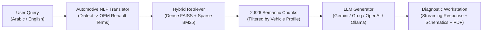

# Renault Mégane I (1995–2002) Workshop Service Manual — AI Assistant & CAD Schematics Studio 🚗⚡

[](https://fastapi.tiangolo.com)
[](https://www.python.org/)
[](#-interactive-2d-cad-digital-schematics-engine)
[](https://pymupdf.readthedocs.io/)
[](#-hybrid-rag--automotive-nlp-engine)
[](#-verification--automated-tests)
[](Dockerfile)


A comprehensive, production-grade **multimodal automotive workstation** and **interactive vector CAD electrical engineering studio** built specifically for the official **Renault Mégane I (Phase 1 & Phase 2, 1995–2002) OEM Factory Workshop Service Manual** (`2,492 pages`).

Combining an advanced **2D Dynamic Drag-and-Drop CAD Schematics Engine** with real-time wire harness stretching, hybrid RAG (Dense Vector + Sparse BM25), Egyptian and North African automotive dialect translation, and interactive physical electrical simulations.

---

## 📑 Table of Contents

- [🌟 Key Architectural Innovations](#-key-architectural-innovations)
- [⚡ Interactive 2D CAD Digital Schematics Engine](#-interactive-2d-cad-digital-schematics-engine)
- [🧠 Hybrid RAG & Automotive NLP Engine](#-hybrid-rag--automotive-nlp-engine)
- [🖥️ Modern Workstation Interface](#-modern-workstation-interface)
- [🏎️ Supported Engines & Transmissions](#️-supported-engines--transmissions)
- [🚀 Quick Start & Local Setup](#-quick-start--local-setup)
- [🔑 AI Model Configuration](#-ai-model-configuration)
- [☁️ Cloud Deployment (Hugging Face Spaces / Docker)](#️-cloud-deployment-hugging-face-spaces--docker)
- [📡 REST API Documentation](#-rest-api-documentation)
- [🧪 Verification & Automated Tests](#-verification--automated-tests)
- [📁 Repository Structure](#-repository-structure)
- [📄 License & Workshop Safety](#-license--workshop-safety)

---

## 🌟 Key Architectural Innovations

### 1. 1:1 OEM Blueprint Digital Vector Reconstruction
Rather than presenting static, low-contrast, black-and-white scanned manual prints from 1995, this workstation features high-definition, mathematically accurate vector circuits modeled directly after Renault factory wiring manuals (`MR312-8`, `MR313`, `MR364`):
- **Full 2D Dynamic Dragging**: Freely reposition modules, relays, sensors, and computers across both X and Y axes.
- **Dynamic Wire Harness Recalculation (60 FPS)**: Moving any component dynamically stretches, curves, and recalculates all connected multi-wire bundles in real-time.
- **Subsystem Isolation**: Hide non-essential circuits to focus strictly on power distribution, solenoids, sensors, ignition, or diagnostic lines without visual clutter.
- **Live Electrical Current Simulation**: Test key states, gear selector lockouts, fan stages, and sensor feedback loops with animated electron current flows.


---

## ⚡ Interactive 2D CAD Digital Schematics Engine

The workstation includes six built-in factory circuits equipped with interactive simulation states, component dragging, and pinout inspection:

| Circuit ID | System Name | OEM Codes & Components Included | Live Interactive Controls |
| :--- | :--- | :--- | :--- |
| `sirius32_ecu` | **Siemens Sirius 32 Engine ECU** | ECU 120, Main Relay 238, Fuel Pump Relay 236, Injectors 1–4, Coils 683/684, TDC Sensor 149, Knock 146, MAP 244, Coolant 244 | Ignition Wake-up (+12V Pin 66), Engine Crank, Sequential Injector Pulsing, Main Relay latch |
| `transmission_ad4_dp0` | **AD4 / DP0 Automatic Transmission** | TCU 119, Multifunction Switch 779, Shift Lock 1041, Solenoids EVM & EV1–EV6, Pressure Sensor 1199, Speed Sensor 796 | Gear Selector (`P`, `R`, `N`, `D`, `3`, `2`, `1`), Starter Inhibitor Lockout (Crank in P/N only), Brake Interlock |
| `obd2_diagnostic_socket` | **16-Pin OBD-II Diagnostic Socket** | Socket 225, ISO 9141 K-Line (Pin 7), L-Line (Pin 15), CAN High (Pin 6), CAN Low (Pin 14), ECU 120, TCU 119, ABS 118, Airbag 756 | Diagnostic Scanner Interrogate, Protocol Traffic Simulation (K-Line vs CAN Bus) |
| `starter_circuit` | **Starter Motor & Ignition Switch** | Starter Motor 163, Ignition Switch Neiman 104, 12V Battery 107, 30A Ignition Fuse | Key Switch (`STOP`, `ACC`, `ON`, `CRANK 🔑`), External Push-Button Starter Bypass Mod Simulator |
| `cooling_fan` | **GMV Radiator Cooling Fan** | Fan Motor 188, Low-Speed Relay 234, Dropping Resistor 0.8Ω, High-Speed Relay 235, Coolant Thermistor | Temperature Slider (70°C – 110°C), Stage 1 Low (92°C), Stage 2 High (98°C), A/C Trinary Trigger |
| `alternator_charging` | **Alternator & Battery Charging** | Alternator 103 with internal regulator, 12V Battery 107, Instrument Cluster Warning Light 111 | Engine Running Toggle, Alternator 14.4V B+ Output, D+ Exciter Line & Warning Light Extinguish |

### Advanced CAD Drag & Dynamic Harness Routing
- **Dual-Axis Drag Engine**: Component bounding boxes listen for pointer events with `.schematic-comp cursor-grab` and update internal layout coordinates on mouse/touch drag.
- **Dynamic Wire Endpoint Recalculation**: Connected lines, orthogonal jogs (`hvh`, `vh`, `hv`), and cubic Bezier S-curves (`M x1 y1 C cx1 cy1 cx2 cy2 x2 y2`) update live, maintaining physical attachment to terminal pins.
- **Zero Splice Residue**: Junction points and splice dots move synchronously with their parent wire bundles, preventing orphaned points on the canvas.
- **Unconfined Viewport**: Pan and zoom smoothly across the entire screen canvas using standard wheel/pinch gestures or top HUD zoom controls (`+`, `-`, `Reset`), with fixed HUD elements that remain completely stationary.

### Clickable Component Pin Inspector
Clicking any electrical pinout (`Terminal 50`, `Pin 66`, `Pin 87`, `Pin 30`, `K-Line`, etc.) launches the **Component Pin Inspector**:
- **Wire Specifications**: Exact cross-sectional gauge (`0.6 mm²`, `1.0 mm²`, `2.5 mm²`, `16 mm²`) and Renault factory color code (`RG` Rouge, `JA` Jaune, `NO` Noir, `BA` Blanc, `VI` Violet, `VE` Vert, `GR` Gris, `MA` Marron).
- **Nominal Operating Voltages**: Key-off, key-on, cranking, and operational sensor ranges (0–5V, 12V Battery, 14.4V Charging).
- **OEM Test Procedures**: Step-by-step multimeter and oscilloscope testing methodology.
- **"Ask AI to Diagnose This Pin"**: Injects pin specifics, subsystem context, and expected fault symptoms directly into the AI diagnostic chat stream.

---

## 🧠 Hybrid RAG & Automotive NLP Engine



### 1. Hybrid Dense/Sparse Retrieval
- **2,626 Semantic Manual Chunks**: Extracted and indexed with rich metadata (section codes, page numbers, system categories, component IDs, torque specifications).
- **FAISS Vector Embeddings + Rank-BM25**: Combined using reciprocal rank fusion with a calibrated balance factor (`alpha = 0.45`) ensuring pinpoint accuracy for both conceptual diagnostic queries and specific part numbers.

### 2. Specialized Arabic Automotive NLP (`query_translator.py`)
Mechanics in Egypt and North Africa commonly use colloquial workshop jargon rather than formal French/English engineering terms. The assistant bridges this gap automatically:
- مارش $\rightarrow$ Starter Motor 163 / Solenoid Terminal 50
- دينامو $\rightarrow$ Alternator 103 / Voltage Regulator
- كتاوت $\rightarrow$ Relay (Relais) / Terminal 30/85/86/87
- فتيس $\rightarrow$ Automatic Gearbox DP0 / AD4 / Manual JB3
- سير كاتينة $\rightarrow$ Timing Belt (Courroie de distribution)
- وش سلندر $\rightarrow$ Cylinder Head / Gasket tightening sequence
- موبينة / مشط $\rightarrow$ Ignition Coil 683/684 / Siemens Sirius 32 ECU
- بوجيهات $\rightarrow$ Spark Plugs (Bougies) / Electrode gap 0.9 mm

All Arabic queries are rendered with strict **BiDi (Bidirectional) text isolation**, ensuring part numbers, pin numbers, and torque values (`100 N.m`, `Pin 66`) format cleanly without line reversals.

### 3. Real-Time High-Resolution PDF Manual Engine (`PyMuPDF`)
- Directly renders any page from the 2,492-page manual at 150 DPI PNG on demand (`/api/pdf/render/<page>`).
- Seamless section code resolution: queries referencing manual section codes (e.g., `10-48` for engine timing, `17-43` for fuel injection, `23-28` for DP0 automatic transmission) automatically resolve to exact absolute manual pages.

---

## 🖥️ Modern Workstation Interface

The user interface is designed as an all-in-one professional workshop dashboard:

1. **Diag & Chat Tab**:
   - Central conversational assistant with streaming Server-Sent Events (SSE).
   - In-chat embedded digital schematic cards with active simulation controls.
   - Expandable source citation drawers displaying manual page previews and exact excerpts.
2. **WIRING Studio Tab**:
   - Full-screen digital schematic workspace with 2D component dragging.
   - Subsystem filter sidebar, circuit selection menu, and live simulation control panel.
   - Zoom controls, reset canvas, and high-resolution export.
3. **Manuals Tab**:
   - High-fidelity PDF document reader with section index navigation, page jumping, and zoom tools.
4. **TORQUE Tab**:
   - Instant search table for critical engine and chassis tightening tolerances:
     - Cylinder head bolts (multi-stage angular torque).
     - Spark plugs, sump drain plug, flywheel bolts, crankshaft pulley.
     - Wheel lug nuts, brake caliper guide pins, suspension ball joints.
5. **Dashboard Tab**:
   - Index telemetry, page count (2,492 pages), chunk statistics (2,626 chunks), and quick-start diagnostic topics.
6. **Session & History Drawer**:
   - Persistent local chat history, session reloading, and one-click export to Markdown (`.md`).

---

## 🏎️ Supported Engines & Transmissions

Customize diagnostic advice, wiring layouts, and torque tables by selecting your exact configuration:

| Engine Family | Displacement & Valves | Code | Fuel System / Management |
| :--- | :--- | :--- | :--- |
| **K4M** | 1.6L 16V DOHC | `K4M 700 / 701 / 708` | Siemens Sirius 32 Multi-point Injection |
| **K7M** | 1.6L 8V SOHC | `K7M 702 / 703` | Siemens Fenix 5 / Magneti Marelli 8R |
| **E7J / K4J** | 1.4L 8V / 16V | `E7J / K4J` | Multi-point Injection |
| **F3R / F7R** | 2.0L 8V / 16V IDE | `F3R / F7R 710` | Siemens / Fenix Electronic Injection |
| **F8Q / F9Q** | 1.9L Diesel / dTi / dCi | `F8Q / F9Q 730` | Bosch / Lucas Diesel Injection |

| Transmission | Type | Gear Count | Key Diagnostic Feature |
| :--- | :--- | :--- | :--- |
| **JB1 / JB3 / JC5** | Transverse Manual | 5-Speed | Clutch adjustment, 75W80 GL-4 (3.4 Liters) capacity |
| **DP0 (Proactive)** | Electronically Controlled Automatic | 4-Speed | Pressure modulation EVM, Multifunction switch 779, Renault Clip diagnostics |
| **AD4** | Hydraulic/Electronic Automatic | 4-Speed | Governor pressure, hydraulic distributor solenoids |

---

## 🚀 Quick Start & Local Setup

### 1. System Requirements
- **Python 3.10** or higher.
- `pip` package manager.
- 4 GB RAM recommended for FAISS vector index & PDF rendering.

### 2. Clone and Install Dependencies
```bash
# Clone the repository
git clone https://github.com/barakota15/renault-megane-rag.git
cd renault-megane-rag

# Create and activate a virtual environment
python3 -m venv venv
source venv/bin/activate       # On Windows: venv\Scripts\activate

# Install required Python packages
pip install -r requirements.txt
```

### 3. Launch the Server
```bash
python3 app.py
```
Or start with `uvicorn` directly:
```bash
uvicorn app:app --host 0.0.0.0 --port 8000 --reload
```

Open your browser and navigate to:
👉 **`http://localhost:8000`**

*(On initial startup, the indexer checks the manual PDF and builds the vector and BM25 databases automatically).*

---

## 🔑 AI Model Configuration

The assistant supports multiple AI providers with automatic context calibration:

| Provider | Recommended Model | Context Size | Ideal Use Case |
| :--- | :--- | :--- | :--- |
| **Google Gemini** | `gemini-1.5-flash` / `gemini-2.5-flash` | **1,000,000 tokens** | **Recommended**: High speed, generous free tier, handles entire repair sessions |
| **Groq** | `llama-3.3-70b-versatile` | **128,000 tokens** | Sub-second response latency |
| **OpenAI** | `gpt-4o` / `gpt-4o-mini` | **128,000 tokens** | Deep diagnostic reasoning & step-by-step troubleshooting |
| **Ollama** | `llama3.2` | **8,192 tokens** | 100% offline, private local inference in the workshop |

### Setting Up API Keys
- **Via the Web Interface (Quickest)**: Click the **Settings (⚙️)** button in the top navigation bar, paste your API key, and click **Save**. Keys are stored securely in browser local storage and sent in request headers.
- **Via `.env` file**: Create a `.env` file in the project root:
```env
GEMINI_API_KEY="AIzaSy..."
GROQ_API_KEY="gsk_..."
OPENAI_API_KEY="sk-..."
```

---

## ☁️ Cloud Deployment (Hugging Face Spaces / Docker)

The application includes a self-contained `Dockerfile` ready for zero-cost, 24/7 cloud hosting on **Hugging Face Spaces**:

1. Create a free account on [Hugging Face](https://huggingface.co).
2. Click **New Space** $\rightarrow$ assign a name (e.g. `renault-megane-workstation`).
3. Select **Docker** as the SDK, choose **Blank**, and create the Space.
4. Push or upload this repository to your Space repository.
5. In your Space **Settings** $\rightarrow$ **Variables and secrets**, add:
   - Secret: `GEMINI_API_KEY` = `your_api_key_here`
6. The container will build and deploy automatically, providing a secure, public HTTPS endpoint accessible from any mobile device or tablet in your garage.

---

## 📡 REST API Documentation

The FastAPI backend exposes clean, structured endpoints:

| Method | Endpoint | Description |
| :--- | :--- | :--- |
| `GET` | `/api/status` | Index health check, total pages (2,492), and total indexed chunks (2,626). |
| `POST` | `/api/search` | Dense/Sparse hybrid search over manual chunks with vehicle profile filtering. |
| `POST` | `/api/chat` | Streaming Server-Sent Events (SSE) diagnostic response with source citations. |
| `GET` | `/api/pdf/render/{page_or_code}` | High-resolution 150 DPI PNG render of manual pages or Renault section codes (`10-48`). |
| `GET` | `/api/pdf/page-info/{page_or_code}` | Resolves section codes to absolute pages and returns metadata. |
| `GET` | `/api/quick-topics` | Quick diagnostic shortcuts (Timing belt, Starter bypass, DP0 fluid change, etc.). |
| `GET` | `/api/schematics/{circuit_id}` | Schematic metadata, component pinouts, and default wire coordinates. |
| `GET` | `/api/saved-chats` | List all saved diagnostic chat sessions. |
| `POST` | `/api/saved-chats` | Save a new diagnostic session. |
| `DELETE`| `/api/saved-chats/{id}` | Delete a saved diagnostic session. |

---

## 🧪 Verification & Automated Tests

A comprehensive 14-suite automated test suite verifies all API endpoints, hybrid retrieval, Arabic translation, PDF page resolution, session persistence, and schematics integrity:

```bash
python3 test_app.py
```

### Test Suite Coverage:
```
✓ GET /api/status - Index verification (2,492 pages, 2,626 chunks)
✓ GET /api/quick-topics - Common diagnostic procedures
✓ POST /api/search - Hybrid Dense/Sparse retrieval accuracy (JB3 capacity match)
✓ GET /api/pdf/render/99 - 150 DPI image stream verification
✓ GET /api/pdf/page-info/328 - Page metadata validation
✓ GET /api/pdf/render/10-48 - Section code resolution to absolute page 92
✓ GET /api/pdf/page-info/10-48 - Section mapping verification
✓ Smart Arabic Query Translation - Automotive dialect & OEM term expansion
✓ POST /api/saved-chats - Session creation, retrieval, and deletion
✓ Multi-Turn Context Evaluation - Follow-up conversation context retention
✓ GET / - HTML Workstation template delivery
✓ Multi-View Layout - Tab structure & decoupled HUD validation
✓ Digital Schematics Engine - 6 factory circuits, pinouts, and simulations
==================================================
ALL AUTOMATED TESTS PASSED! 🚀
==================================================
```

---

## 📁 Repository Structure

```
├── renault-megane-1995-2002-factory-workshop-service-manual.pdf  # Factory Service Manual (2,492 pages)
├── app.py                                                       # FastAPI web application & REST endpoints
├── Dockerfile                                                   # Production Docker container configuration
├── .dockerignore                                                # Build exclusions
├── requirements.txt                                             # Python dependencies
├── test_app.py                                                  # 14-suite automated integration test runner
├── rag/
│   ├── chunker.py                                               # Semantic PDF chunking & metadata enrichment
│   ├── generator.py                                             # Multi-provider LLM streamer & prompt engineer
│   ├── indexer.py                                               # FAISS vector DB & Rank-BM25 indexer
│   ├── pdf_parser.py                                            # PyMuPDF section scanner & page renderer
│   ├── query_translator.py                                      # Arabic automotive dialect dictionary & BiDi isolation
│   └── retriever.py                                             # Hybrid dense/sparse retriever & vehicle profile filter
├── static/
│   ├── app.js                                                   # Workstation tabs, chat streaming, session manager
│   ├── schematics.js                                            # 2D Interactive CAD Engine, wire recalculation, simulations
│   ├── style.css                                                # Dark workshop theme, wire animations, BiDi styling
│   ├── real_screenshot.png                                      # Diagnostic chat & in-line schematic card preview
│   └── wiring_studio_screenshot.png                             # Dedicated 2D CAD Wiring Studio preview
└── templates/
    └── index.html                                               # Multi-view workstation layout & Pin Inspector modal
```

---

## 📄 License & Workshop Safety

- **Manual Intellectual Property**: The underlying vehicle workshop service manual, diagrams, and Renault engineering specifications are property of **Renault S.A.** This application is designed for educational, research, personal maintenance, and private diagnostic assistance.
- **Workshop Safety Disclaimer**: Automotive repair involves electrical hazards, high fluid pressures, mechanical pinch points, and heavy lifting. Always disconnect the negative battery terminal before servicing electrical circuits, support vehicles with certified jack stands, wear safety glasses and protective gear, and confirm critical torque specifications against cited manual pages prior to mechanical assembly.
