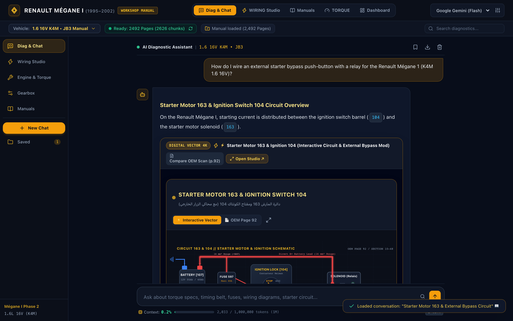
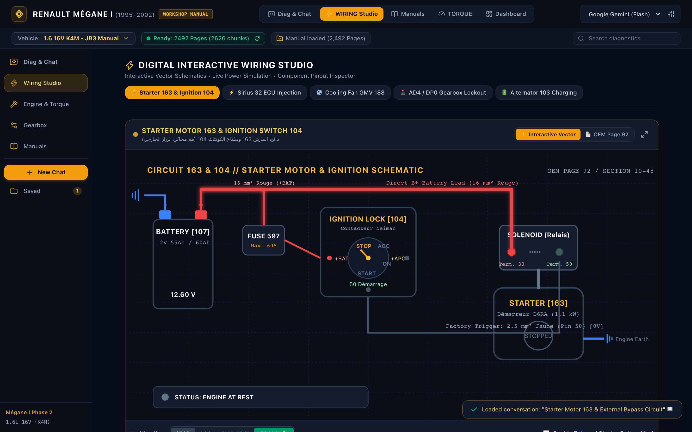

# Renault Mégane I (1995–2002) Workshop Service Manual — AI Assistant 🚗🔧



A production-ready, multimodal **Retrieval-Augmented Generation (RAG)** automotive workstation designed specifically for the complete official **Renault Mégane I (1995–2002) OEM Factory Workshop Service Manual** (`2,492 pages`).

Featuring an **Interactive Digital Vector Schematics Engine**, real-time electrical simulations, multi-turn diagnostic chat, and personalized vehicle profiling.

---

## 🌟 Key Features & Architecture

### 1. Spacious, Chat-Centric Workstation UI
- **Primary Diagnostic Chat**: A spacious, distraction-free central diagnostic chat area designed for reading long-form technical procedures, wiring instructions, and torque specifications without cramped layouts.
- **Top Workstation Navigation Tabs & Left Rail**:
  - **Diag & Chat** (Default): Full-viewport multi-turn automotive diagnostic chat.
  - **WIRING Studio**: Dedicated full-screen interactive digital wiring schematics studio.
  - **Manuals**: High-resolution 150 DPI page-by-page reader for all 2,492 manual pages.
  - **TORQUE**: Real-time factory tightening tolerances and Renault Mégane I chassis blueprint.
  - **Dashboard**: Classic 4-card workstation overview.



### 2. Built-in Digital Interactive Vector Schematics ("Antigravity Schematics Engine")
Rather than relying on blurry black & white scanned manual drawings, the application includes native 4K vector schematics with live electrical current animations and interactive simulation controls:
- **Starter Motor 163 & Ignition Switch 104**:
  - Live key positions (`STOP`, `ACC`, `ON`, `CRANK 🔑`).
  - **External Push-Button Starter Bypass Mod Simulator**: Test the circuit with an auxiliary 30A/40A relay, 25A fuse, and cabin momentary push button wired directly to Solenoid Terminal 50.
- **Siemens Sirius 32 Engine ECU 120**:
  - Pin 66 +12V ignition contact input, Main Relay 238, Fuel Pump Relay 236, Injectors 1–4 sequential firing, and TDC Crankshaft Sensor 149.
- **GMV Radiator Cooling Fan 188**:
  - **Coolant Temperature Slider (70°C – 110°C)**: Dynamically simulates Stage 1 low speed via Relay 234 and 0.8Ω dropping resistor (92°C), and Stage 2 direct high speed via Relay 235 (98°C), with A/C request toggle.
- **Automatic Transmission AD4 / DP0**:
  - Multifunction Switch 779 selector (`P`, `R`, `N`, `D`, `2`, `1`) with live starter inhibitor safety lockout (cranking permitted in P/N only).
- **Alternator 103 & 12V Battery Charging**:
  - Simulates engine rotation, alternator 14.4V charging output to Battery 107 (Terminal B+), and instrument cluster battery warning lamp 111 (Terminal D+).

### 3. In-Chat Interactive Diagram Cards & Pin Inspector
- Whenever the AI discusses an electrical circuit or cites a diagram, a live **Digital Interactive Schematic Card** is embedded directly inside the message.
- **Clickable Pinout Inspector**: Click any pin (`Terminal 50`, `Terminal 30`, `Pin 66`, `Pin 87`, etc.) to view:
  - Exact wire gauge and Renault OEM color code (`RG` Rouge/Red, `JA` Jaune/Yellow, `NO` Noir/Black, etc.).
  - Expected operating voltage.
  - Workshop diagnostic testing procedure with a direct **"Ask AI to Diagnose This Pin"** button.
- **OEM Scan Toggle**: Side-by-side comparison with the original 1995 scanned manual page.

### 4. Automatic Language Detection & BiDi Typography
- **Arabic Inquiries**: Queries submitted in Arabic are understood in automotive workshop context (including Egyptian/North African mechanic terms like مارش, دينامو, كتاوت, سير كاتينة, بوجيهات, وش سلندر, فتيس). Responses are provided in clean Arabic with strict `BiDi` isolation for part codes, pin numbers, and English terms.
- **English Inquiries**: Responds in technical English with OEM Renault terminology and procedure citations.

### 5. Active Vehicle Profile Personalization
- Tailor all torque tolerances, oil capacities, fluid grades, and wiring diagrams to your exact car:
  - **Engines**: `1.6 16V (K4M)`, `1.6 8V (K7M)`, `1.4 8V/16V (E7J / K4J)`, `2.0 8V/16V (F3R / F7R IDE)`, `1.9 dTi/dCi Diesel (F8Q / F9Q)`.
  - **Transmissions**: `JB1 / JB3 / JC5` 5-Speed Manual, `DP0 Proactive` 4-Speed Automatic, `AD4` Automatic.

### 6. Multi-Turn Context & Session Management
- Retains diagnostic conversation context across multiple turns for complex troubleshooting.
- Real-time token context meter automatically calibrated to the active AI model:
  - **Google Gemini**: Up to 1,000,000 tokens (1M context).
  - **Groq (Llama 3.3 70B)**: 128,000 tokens.
  - **OpenAI (GPT-4o)**: 128,000 tokens.
  - **Local Ollama**: 8,192 tokens.
- Save, reload, and export diagnostic chat sessions as Markdown (`.md`).

---

## 🚀 Quick Start & Local Setup

### 1. Prerequisites
- **Python 3.10** or newer installed.
- (Optional) `pip` and a virtual environment.

### 2. Clone and Install Dependencies
```bash
# Clone the repository
git clone https://github.com/your-username/renault-megane-rag.git
cd renault-megane-rag

# (Optional) Create a virtual environment
python3 -m venv venv
source venv/bin/activate  # On Windows: venv\Scripts\activate

# Install requirements
pip install -r requirements.txt
```

### 3. Run the Application
```bash
python3 app.py
```
Open your web browser and navigate to:
👉 **`http://localhost:8000`**

On the first launch, the system automatically parses and indexes the 2,492-page manual into vector and BM25 databases.

---

## 🔑 AI Model & API Key Configuration

The assistant supports multiple AI providers:

| Provider | Model | Context Window | Best For |
| :--- | :--- | :--- | :--- |
| **Google Gemini** | `gemini-1.5-flash` / `gemini-2.5-flash` | 1,000,000 tokens | **Recommended** (Fast, generous free tier, 1M context) |
| **Groq** | `llama-3.3-70b-versatile` | 128,000 tokens | Blazing fast inference speed |
| **OpenAI** | `gpt-4o` / `gpt-4o-mini` | 128,000 tokens | High precision diagnostic reasoning |
| **Ollama** | `llama3.2` | 8,192 tokens | 100% offline local privacy |

### Setting Up API Keys:
1. **Via UI (Easiest)**: Click the **Settings (⚙️)** icon in the top right corner of the workstation header, paste your API key, and click **Save Settings**. Your key is securely stored in your browser's local storage.
2. **Via `.env` file**: Create a `.env` file in the root folder:
```env
GEMINI_API_KEY="AIzaSy..."
GROQ_API_KEY="gsk_..."
OPENAI_API_KEY="sk-..."
```

---

## ☁️ 24/7 Cloud Hosting (Hugging Face Spaces - Free)

To use this diagnostic assistant on your smartphone in the garage or workshop without keeping your computer turned on:

1. Create a free account at [Hugging Face](https://huggingface.co).
2. Click **New Space** → Set a Space Name (e.g. `renault-megane-ai`).
3. Select **Docker** as the SDK, choose **Blank template**, and click **Create Space**.
4. Push or upload this project repository (the included `Dockerfile` and `.dockerignore` are pre-configured).
5. In your Space settings, go to **Settings** → **Variables and secrets** and add:
   - Secret Name: `GEMINI_API_KEY`
   - Secret Value: Your Google Gemini API key
6. Hugging Face will automatically build and launch the Docker container. You will receive a permanent public HTTPS URL that can be added to your mobile home screen as a web app.

---

## 📁 Repository Architecture

```
├── renault-megane-1995-2002-factory-workshop-service-manual.pdf  # OEM Factory Manual (2,492 pages)
├── app.py                                                       # FastAPI web application & endpoints
├── Dockerfile                                                   # Cloud container configuration
├── .dockerignore                                                # Excluded build artifacts
├── requirements.txt                                             # Python dependencies
├── rag/
│   ├── chunker.py                                               # Semantic manual chunking & metadata
│   ├── generator.py                                             # Multi-provider LLM streamer & prompt engineer
│   ├── indexer.py                                               # Vector DB (FAISS/Chroma) & BM25 management
│   ├── pdf_parser.py                                            # PyMuPDF parser & section indexer
│   ├── query_translator.py                                      # Arabic automotive terms & Renault jargon map
│   └── retriever.py                                             # Hybrid dense/sparse search & vehicle filter
├── static/
│   ├── app.js                                                   # Workstation tabs, multi-view, chat & hydration
│   ├── schematics.js                                            # Digital vector schematics engine & simulations
│   ├── style.css                                                # BiDi typography, wire animations & dark theme
│   ├── real_screenshot.png                                      # Real UI screenshot (Spacious Chat & Schematic)
│   ├── wiring_studio_screenshot.png                             # Real UI screenshot (Interactive Wiring Studio)
│   └── preview.jpg                                              # Primary documentation preview image
├── templates/
│   └── index.html                                               # Multi-view workstation & pin inspector modal
├── test_app.py                                                  # Automated API & RAG test suite
└── test_schematics_and_views.py                                 # Automated Schematics & View tests
```

---

## 🧪 Verification & Automated Tests

To run the complete automated test suite:
```bash
# 1. Test backend RAG retrieval, PDF rendering, and chat endpoints
python3 test_app.py
```

Expected output:
```
==================================================
ALL AUTOMATED TESTS (INCLUDING MULTI-TURN CONTEXT & SAVED CHATS) PASSED! 🚀
==================================================
```

---

## 📄 License & Disclaimer

- **Manual Content**: All factory service manual contents and vehicle diagrams are property of **Renault S.A.** This project is intended for educational, repair, and personal vehicle maintenance purposes.
- **Safety Notice**: Automotive repair involves inherent risks. Always follow proper workshop safety standards, use appropriate personal protective equipment (PPE), and cross-check torque tolerances with the official manual pages cited by the AI assistant.
